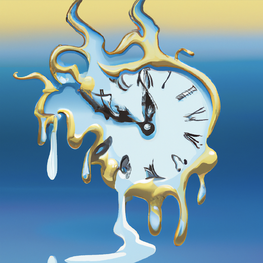

# `once`  

<!-- badges: start -->

<!-- badges: end -->

An R package that makes it easy to execute expensive operations only once.


Using `once()` you can wrap an expensive operation so that output is saved to disk. If the file exists, it won't run again, it will just load the saved version. 

Eg. instead of 

```{r}
file_path <- "saved_objects/saved_random_number.Rds"

if (file.exists(file_path)){

  my_number <- readRDS(file = file_path)

} else {

  my_number <-
    runif(1e8) %>% # some expensive operation
    mean()
  # or ML model training such as 
  # `my_trained_models <- train_models_function(...)`
  
  saveRDS(my_number, file = file_path)
}
```

it would look like

```{r}
my_number <-
  runif(1e8) %>% # some expensive operation
  mean() %>%
  once(file_path = "saved_objects/saved_random_number.Rds") 
```
which will only execute the expensive operation the first time the code is run, and save this output to file.


## Install instructions

```{r}
#install.packages("devtools")
devtools::install_github("gdmcdonald/once")
library(once)
```
## Further details

You can also force it to run again, which will cause it to overwrite the saved object on disk:

```{r}
my_number <-
  runif(1e8) %>% # some expensive operation
  mean() %>%
  once(file_path = "saved_objects/saved_random_number.Rds",
       rerun = TRUE ) # rerun and overwrite the existing file
```
